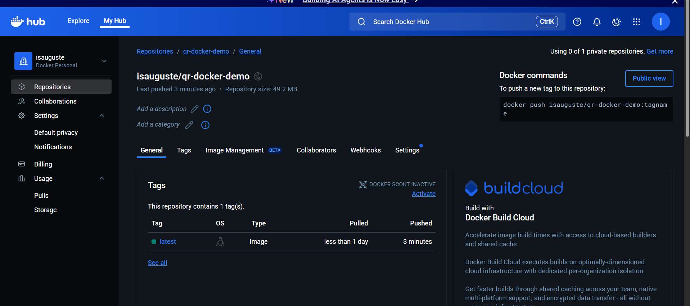

# DevOps CI/CD Pipeline Demo

This assignment demonstrates a complete CI/CD workflow using **GitHub Actions** to:

-  Run automated tests with `pytest`
-  Build a Docker image from source code
-  Push the Docker image to **Docker Hub**

---

## Assignment Overview

- `main.py`: A simple Python script with a function to return a message
- `tests/start_test.py`: A unit test to verify the message output
- `Dockerfile`: Docker configuration to build the app
- `.github/workflows/production.yaml`: GitHub Actions workflow for CI/CD

---

##  Docker Image

Image automatically pushed to Docker Hub after successful test:

🔗 [https://hub.docker.com/r/isauguste/qr-docker-demo](https://hub.docker.com/r/isauguste/qr-docker-demo)

---

##  Docker Hub Screenshot

Below is a screenshot of the image in my Docker Hub account:

---

## 🛠 Tools Used

- **Python 3.10**
- **Pytest**
- **Docker**
- **Docker Hub**
- **GitHub Actions**

---

